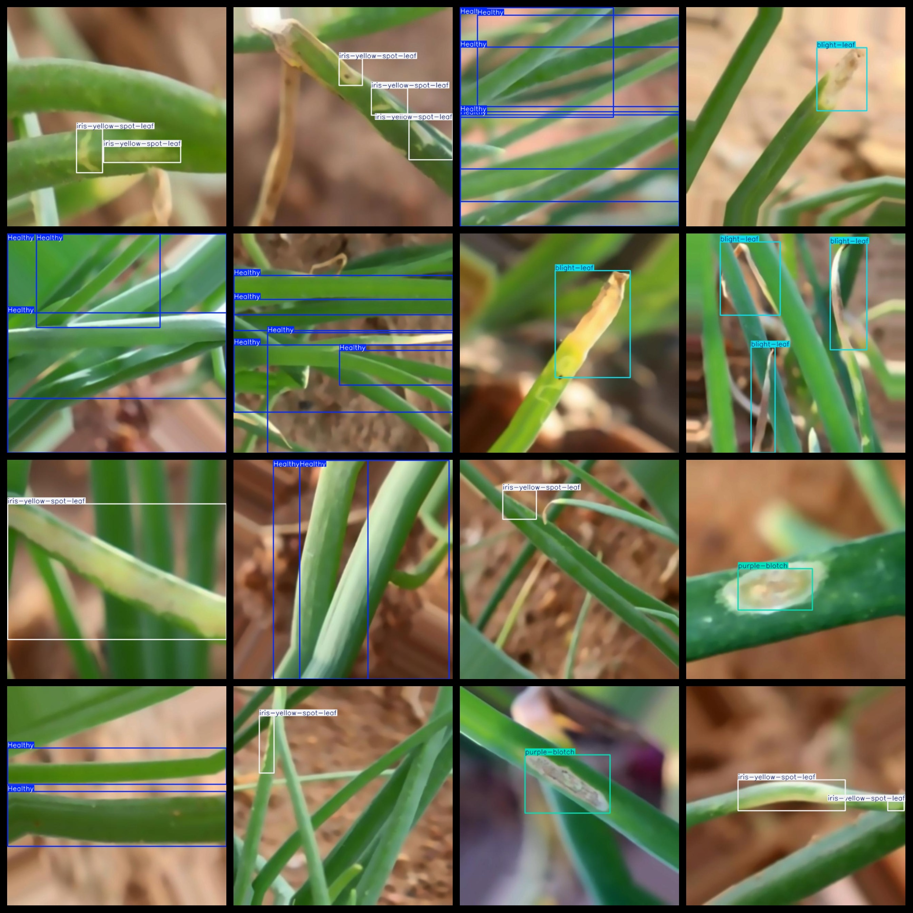
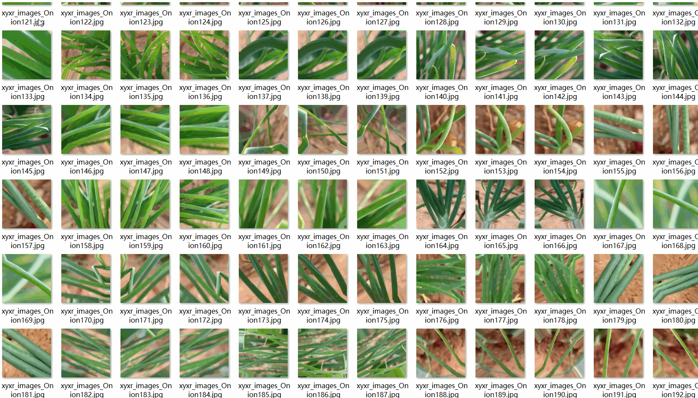

# Onion Leaf Disease Dataset 2000 imagesVOC+YOLO format

The onion leaf disease dataset is a collection of 2000 images in the format of VOC+YOLO.

Dataset Format: VOC format + YOLO format

The compressed file contains: three folders, each storing images, xml files, and text files.

Total jpg images in JPEGImages folder: 2000

The total number of XML files in the Annotations folder is 2000.

The total number of txt files in the labels folder is 2000.

Number of tag categories: 4

Tag names: ["Healthy","blight-leaf","iris-yellow-spot-leaf","purple-blotch"]

The number of boxes for each label (Note that the order of labels in the Yolo format does not correspond to this, but is based on the classes.txt file in the labels folder):

Healthy frame count = 1351

blight-leaf frame count = 543

iris-yellow-spot-leaf frame count = 1333

purple-blotch frame count = 582

Total boxes: 3809

Picture clarity (Resolution: Pixels): Clear

Image Enhancement: Yes

Shape of the label: Rectangular box, used for object detection and recognition.

Important Note: None

Special Notice: This dataset does not guarantee the accuracy or precision of the trained models or weight files. The dataset only provides accurate and reasonable annotations.

Annotation and image details are as follows:

## Images

---

Here is a pay link on Stripe (https://buy.stripe.com/3cs8yP7sY87d0vu9AB). Please contact me lonlonago@foxmail.com after funding $89, and I will send you a complete data files, thank you!

